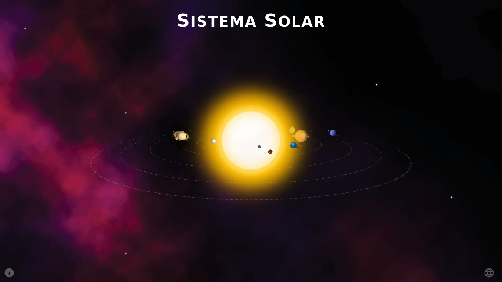
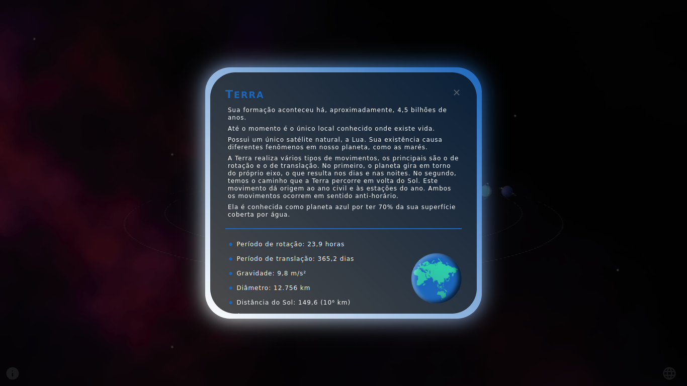
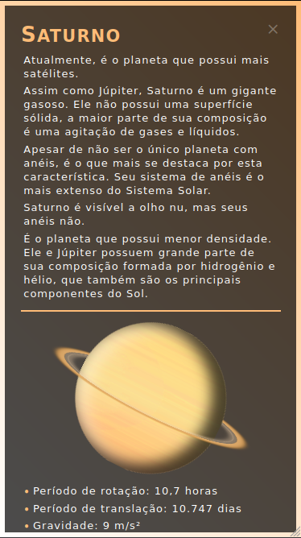
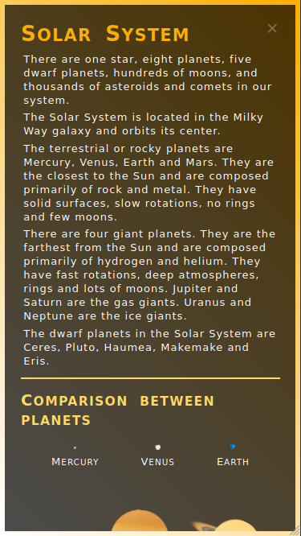
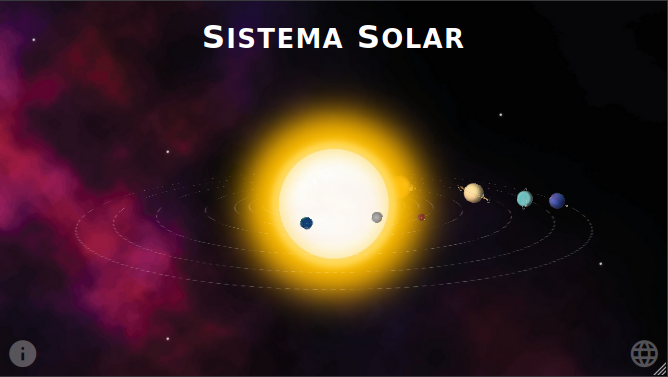

# Sistema Solar :sunny: :earth_americas: :star: :crescent_moon:

Este projeto apresenta uma simulação do Sistema Solar. Com o Sol no centro da animação, os planetas são exibidos ao redor da estrela. Foram definidos para cada um os movimentos de rotação e translação, além dos seus satélites com suas respectivas órbitas.
Informações sobre o Sol, os planetas, o Sistema Solar e a aplicação estão disponíveis em Português e Inglês. O mecanismo da simulação foi inteiramente desenvolvido com HTML e CSS. O conteúdo é apresentado de forma responsiva e buscou-se manter uma boa organização do projeto.

Os elementos foram definidos numa perspectiva 3D a partir das transformações visuais que a propriedade *transform* dispõe. Outras manipulações foram realizadas a partir da propriedade *position* e do uso de *pseudo-elementos* e *pseudo-classes*.

A execução da animação não depende de *JavaScript*. Toda a dinâmica da simulação foi gerada via CSS a partir das propriedades do tipo *animation*. O JS foi utilizado apenas para a apresentação de informações numa janela modal e para a troca do idioma da página. Os dados são carregados de arquivos Json. Para exibir as respectivas informações basta clicar no corpo celeste ou em sua órbita, no título da página ou no botão de informações no canto inferior esquerdo. Para a troca de idioma basta acionar o botão inferior direito.

## :gear: Tecnologias

- HTML
- CSS
- JavaScript

## :art: Layout

